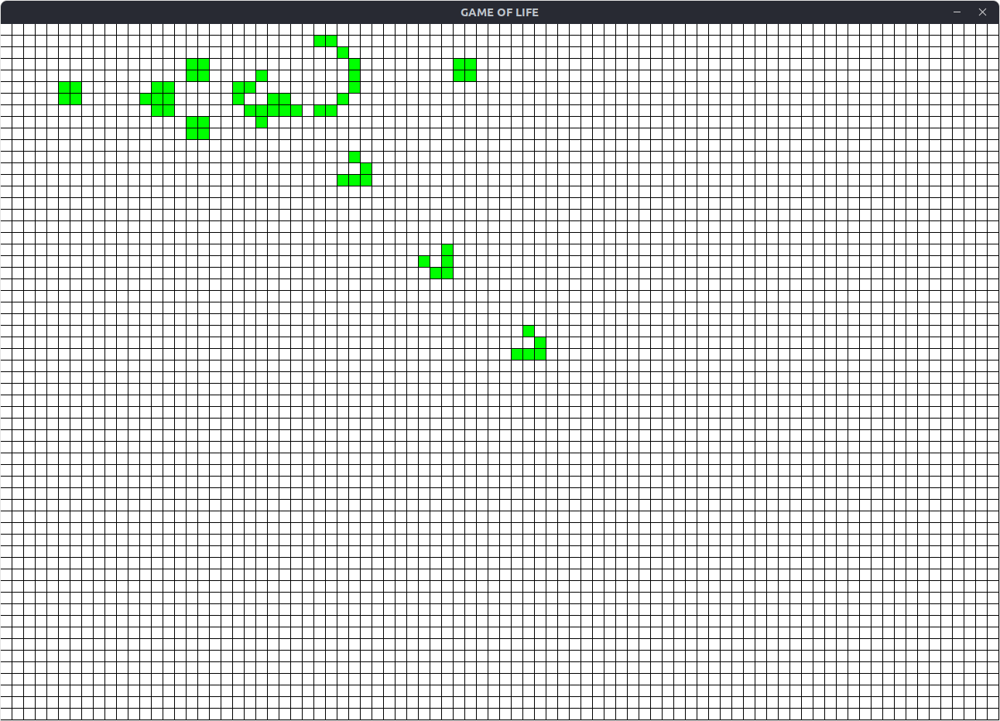
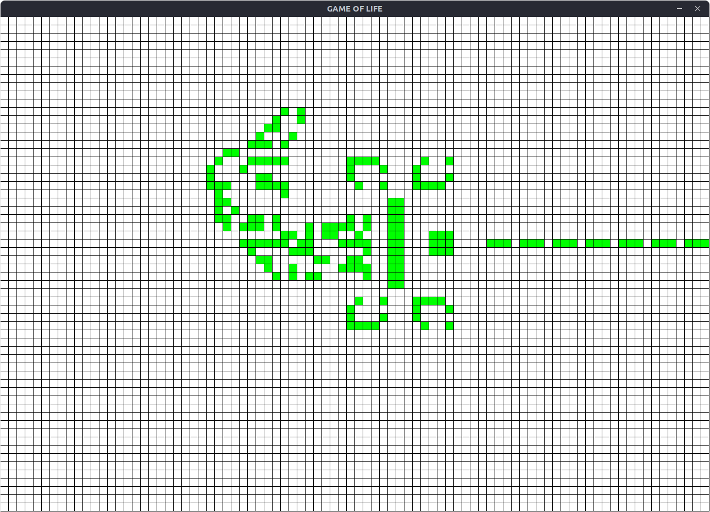
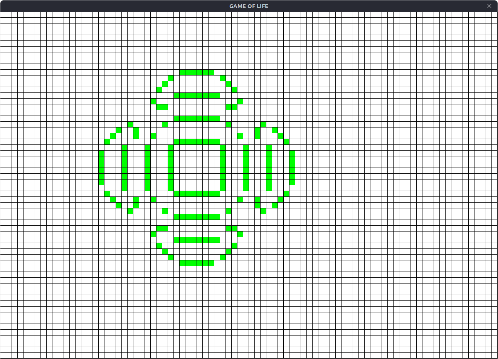

# game-of-life
Simple one-day sfml project. 
## Description:
[Conway's Game of Life](https://en.wikipedia.org/wiki/Conway%27s_Game_of_Life) is zero-player game played on grid of square cells. Cell can be either live (green cells) or dead (white cells). Given initial state every next iteration is based on previous layout. Rules:
* dead cell that has exactly 3 alive neighbours will become alive in next iteration,
* alive cell that has exactly 2 or 3 alive neighbours will remain alive,
* every other cell will remain dead or be killed. 

Periodic boundary conditions are used, which means that that grid is surrounded by translated copies of itself (for example first cell in nth row is considered to be adjacent do last cell in the same row). Diagonal adjacency is also considered a neighbourhood.
## Options:
During game you can select area:
* with left mouse button and populate selected cells,
* with right mouse button and kill selected cells,

or you can press:
* Esc to leave game,
* Space to simulate single iteration,
* Enter to run/stop simulation.
During simulation you can manipulate speed using:
    - ] to double the speed,
    - [ to reduce speed twice.
* R to stop simulation and clear grid layout,
* E to export layout to file.

## Exporting / Importing:
Exported file will be located in current working directory with name "out.txt". It's built of lines containing positions of alive cells:
```
i j
```
where ```i``` is index or cells row, and ```j``` is index of cells column. 
Same type of file is used to import. To import run game with filename:
```
    $ gameoflife <filename>
```
```Filename``` might be name of the preset to be found in ~/.gameoflife/presets. If its not, absolute path will be checked and finally current working directory.
### Examples:
Importing preset:
``` 
    $ gameoflife gun
```
Importing using absolute path:
```
    $ gameoflife ~/Documents/gol.txt
```
Import using path relative to current working directory:
```
    $ gameoflife ../in.txt
```
Cells from file will be brought to life, while the rest will remain bloodless. 
## Requirements:
unix-like os (I think windows will work too, but I'm not sure) with [sfml](https://github.com/SFML/sfml) installed. 
### Debian family linux:
```
    $ sudo apt install sfml
```
## Installing:
Clone repo then:
```
    $ cd game-of-life-sfml
    $ mkdir build
    $ cd build
    $ cmake ..
    $ sudo make install
```
## Files:
&nbsp; ~/.gameoflife/presets/ <br>
&nbsp; Default location for presets.

## Screenshots:
Gun preset after few iterations:

Hivenudger2 after few generations:

20x20 square after 7 ticks:

